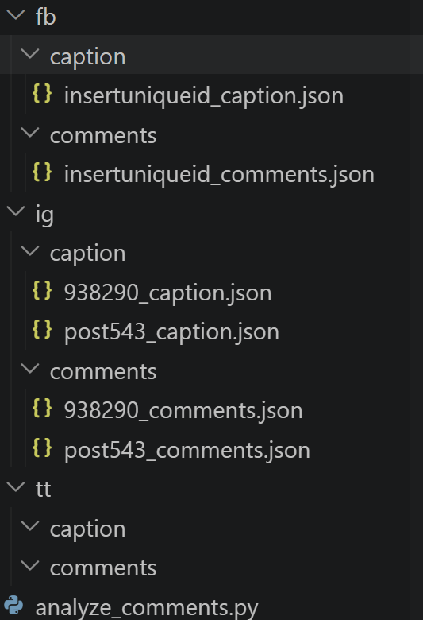

#analyze_comments.py

This is a tool which can be utilized to filter and analyze statistics relating to a collection of strings, 
primarily captions and comments left on posts from Instagram, Facebook, and TikTok. In its current capacity, 
it calculates numerous metrics relating to the frequency of comments, user tags in comments, hashtags,
and keyword matching relating to safety and negativity in captions and comments, both cumulatively and categorized 
in various fashion by safety, primarily between posts deemed 'safe' and 'unsafe' by keyword.

To use this tool, comments are to be included in a .json file with some unique identifier as its name, relating to the post (e.g. post1234_comments.json).
Comments should be in the format of one string per comment, and in a string seperated array enclosed by brackets. (e.g. ["comment1", "comment2", "comment3"]).
Each .json file should correspond to one post's comment section, and should be placed in the 'comments' subfolder under its associated platform folder
(e.g. ig/extracted/insta8394849_comments.json).

Captions are to stored as a SINGLE string (not an array), and placed inside a .json file of the SAME ID in the corresponding 'caption' subfolder, but followed
by _caption instead of _comments.

It is important to note that there should be no underscores ("_") in either file name besides the one preceding either "comments" or "captions".
An example of acceptably named and placed files is included below.

When the script is run, it will pull all comments and captions from each platform folders' subfolder, perform the analysis, and output all calculated metrics
into an organized format and saved to 'analysis.json' in the same directory the program resides.
